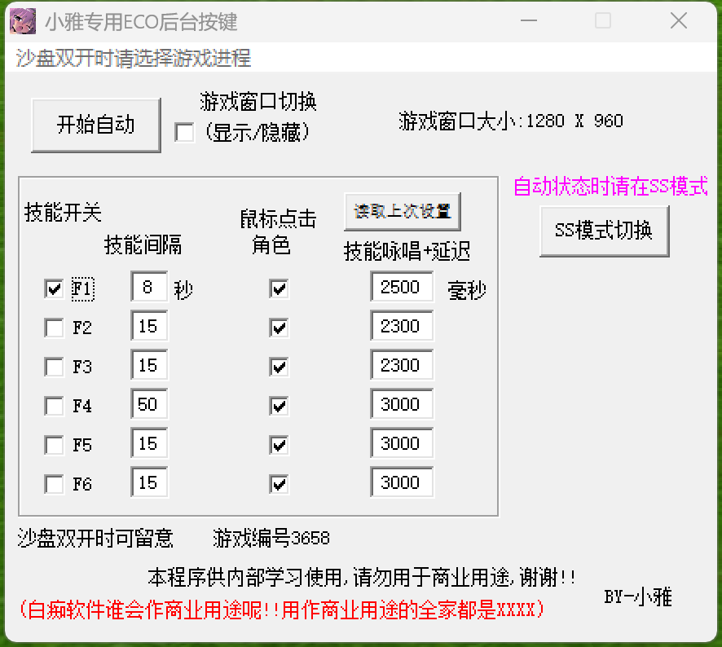
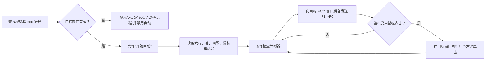

# 小雅行为分析

## 分析边界

本报告来自 PE、资源、字符串、反汇编和反编译结果。分析期间没有启动原版
`小雅.exe`，没有连接或控制 ECO，也没有发送键盘、鼠标输入。

2026-07-24 在用户逐次确认后完成了第一次受控动态观察。动态阶段只启动一次性
副本、读取界面和正常关闭，没有点击“开始自动”，没有主动发送 F1～F6。

原文件：

- 路径：`小雅/小雅.exe`
- 类型：32 位 Windows PE
- 大小：737,280 字节
- SHA-256：`0F825CE15B3AE629C21798D7BD093740FD4B0EFCDBF2B81F4F10D35D020449A5`
- 技术特征：易语言程序，静态链接系统核心支持库和多线程支持库

## 已确认的界面和功能

程序标题为“小雅专用ECO后台按键”。主界面包含：

- ECO 进程选择和刷新；
- 沙盘双开时通过列表选择具体游戏进程；
- 开始自动、停止；
- 隐藏/显示游戏窗口；
- 显示按键平台；
- 保存数据、退出；
- 六行 F1～F6 技能配置。

原版实际界面：



界面提示包括：

- “沙盘双开时请选择游戏进程”；
- “自动状态时请在SS模式”；
- “技能开关”；
- “技能间隔”；
- “鼠标点击”；
- “技能咏唱+延迟”；
- “技能后延迟1”～“技能后延迟6”。

## 六行配置的准确含义

旧版 GBK INI 为 `小雅身体配置.ini`：

| INI 节 | 字段 | 含义 | 单位 |
|---|---|---|---|
| 设置1 | F1～F6 | 是否启用该技能行 | 真/假 |
| 设置2 | 技能时间1～6 | 自动执行的技能间隔 | 秒 |
| 设置3 | 鼠标1～6 | 发出按键后是否追加鼠标点击 | 真/假 |
| 设置4 | 延迟时间1～6 | 按键动作中的技能后延迟 | 毫秒 |

当前随程序保存的配置值为：

| 技能 | 启用 | 间隔（秒） | 鼠标点击 | 后延迟（毫秒） |
|---|---:|---:|---:|---:|
| F1 | 是 | 8 | 是 | 2500 |
| F2 | 否 | 15 | 是 | 2300 |
| F3 | 否 | 15 | 是 | 2300 |
| F4 | 否 | 50 | 是 | 3000 |
| F5 | 否 | 15 | 是 | 3000 |
| F6 | 否 | 15 | 是 | 3000 |

这些值是当前 INI 内容，不一定是程序最初发布时的出厂默认值。

## 已确认的运行流程



静态代码显示：

1. 程序以 `eco` 为进程名搜索目标，也提供进程列表供双开时手工选择。
2. 目标失效后会停止自动状态、清空目标，并重新显示“请选择进程”。
3. 自动循环为六行分别维护最近执行时间。
4. 六行对应虚拟键码 `0x70`～`0x75`，即 F1～F6。
5. 按键通过目标窗口消息执行，不要求把 ECO 切到前台。
6. 勾选“鼠标点击”后，会追加一组左键按下/抬起消息。
7. “隐藏/显示游戏窗口”是独立开关，不是最小化小雅自身。
8. 关闭或退出时会停止自动流程、恢复游戏窗口状态并保存配置。

## 第一次动态观察结果

测试副本目录：

`C:\Users\31459\Documents\抓包游戏\reverse_xiaoya\dynamic-test-01`

观察结果：

- 主窗口标题为“小雅专用ECO后台按键”，窗口大小约为 886×794；
- 没有创建子进程，没有发现该进程的 TCP 或 UDP 连接；
- 测试目录没有新增临时文件；
- 启动时已有一个 `eco.exe` 在运行，原版自动识别并显示“游戏编号3658”；
- `3658` 不是 `eco.exe` 的 Windows PID，属于原程序内部枚举出来的游戏编号；
- 检测到游戏后，“开始自动”可见，“选择进程”和“停止”隐藏；
- 六行当前值与 GBK INI 完全一致；
- 界面存在“读取上次设置”，没有可见的“保存数据”按钮；
- 正常关闭时会重写测试副本 INI，因此修改时间发生变化；
- 重写后的 INI 字节、大小和 SHA-256 均未变化；
- 原始目录中的 EXE 和 INI 未被修改；
- 退出后没有残留原版进程。

原生子控件 ID：

| 功能 | 控件 ID |
|---|---|
| 开始自动 / 停止 / 选择进程 | 130 / 100 / 560 |
| 显示或隐藏游戏 | 390 |
| 读取上次设置 | 490 |
| SS 模式切换 | 500 |
| F1～F6 技能开关 | 150、160、170、180、190、200 |
| F1～F6 技能间隔 | 210、220、230、240、250、260 |
| F1～F6 鼠标点击 | 270、280、290、300、310、320 |
| F1～F6 技能后延迟 | 330、340、350、360、370、380 |

## 第二次隔离消息测试

第二次测试没有连接真实 ECO。测试副本中只有以下三个 ASCII 目标字符串被等长替换：

```text
eco -> xya
```

总计只改变 9 个字节。随后启动自建的 Windows x86 `xya.exe` 无害窗口探针，
原版识别到探针的 `320 × 210` 客户区后才执行自动流程。

测试配置：

- 只启用 F1；
- 技能间隔 2 秒；
- 技能后延迟 600 毫秒；
- 分别记录“鼠标点击关闭”和“鼠标点击开启”；
- 所有开始、停止和关闭操作均通过小雅自身窗口/按钮句柄完成，没有使用屏幕坐标。

### 启动和停止

启动自动时原版先执行一次 SS 模式切换：

1. 全局按下 `Ctrl`；
2. 向目标发送 `T` 按下；
3. 目标收到 `WM_CHAR 0x14`；
4. 释放 `T` 和 `Ctrl`；
5. 开始 F1 技能循环。

停止自动时会再次执行相同的 `Ctrl+T`，用于退出 SS 模式。

探针没有收到 `Ctrl` 的窗口消息，但 `T` 产生了控制字符 `0x14`；结合静态代码，
这说明 Ctrl 状态来自全局键盘状态，而 T 是发送给后台目标窗口的消息。

### F1 消息

F1 的窗口消息参数稳定为：

| 消息 | `wParam` | `lParam` |
|---|---:|---:|
| `WM_KEYDOWN` | `0x70` | `0x003B0001` |
| `WM_KEYUP` | `0x70` | `0xC03B0001` |

- 扫描码为 `0x3B`；
- 按住时间约 34～47 毫秒；
- 稳定循环周期约 1.93～2.00 秒，与配置的 2 秒吻合；
- 启动自动后还会立即执行一次首轮技能。

### 鼠标消息

鼠标开关关闭时没有任何鼠标消息。

鼠标开关开启时，每次 F1 抬起后约 3 毫秒执行：

| 顺序 | 消息 | `wParam` |
|---:|---|---:|
| 1 | `WM_MOUSEMOVE` | `0x2` |
| 2 | `WM_LBUTTONDOWN` | `0x1` |
| 3 | `WM_MOUSEMOVE` | `0x2` |
| 4 | `WM_LBUTTONUP` | `0x0` |

左键按住约 42～43 毫秒。测试坐标始终为 `(321, 210)`，接近探针客户区右下角。
这与静态函数中的屏幕坐标到目标客户区坐标换算一致，说明原版点击的是“当前鼠标
位置在目标窗口中的相对坐标”，而不是保存的固定坐标。

原始消息证据：

- [鼠标关闭](./evidence/xiaoya-mouse-off.jsonl)
- [鼠标开启](./evidence/xiaoya-mouse-on.jsonl)

### 600 毫秒字段

600 毫秒没有出现在 F1 按下/抬起、F1 到鼠标点击、左键按下/抬起或 2 秒技能周期中。
第三次测试进一步确认：它是整次技能动作完成后的阻塞休眠；当它小于技能间隔时，
技能间隔仍然主导下一次触发时间。

## 第三次隔离延迟测试

第三次测试继续使用等长替换后的 `xya` 测试副本和自建的 x86 无害窗口探针，
没有连接真实 ECO。两轮配置都只启用 F1：

- 技能间隔 1 秒；
- 技能后延迟 3000 毫秒；
- 分别记录“鼠标点击关闭”和“鼠标点击开启”。

鼠标关闭时，连续四次 F1 按下时间为：

```text
33580.231 ms
36629.392 ms  (+3049.162 ms)
39680.270 ms  (+3050.877 ms)
42734.437 ms  (+3054.168 ms)
```

F1 抬起到下一次 F1 按下约为 3005 毫秒，说明后延迟从按键动作结束后开始。

鼠标开启时，连续四次 F1 按下间隔为 3089.028、3105.245 和 3104.897 毫秒。
第一、二次鼠标抬起到下一次 F1 按下分别为 3006.363 和 3013.192 毫秒，
说明启用鼠标时，后延迟从完整鼠标点击动作结束后开始，而不是从 F 键触发时开始。

据此可确定单次调度语义：

```text
等待技能间隔到期
→ F 键按下/抬起
→ 可选的鼠标移动与左键点击
→ 技能后延迟阻塞
→ 重新检查技能间隔
```

当后延迟大于技能间隔时，后延迟主导实际周期；探针记录中额外约 5～13 毫秒
来自消息处理和调度循环开销。

原始消息证据：

- [3000 毫秒、鼠标关闭](./evidence/xiaoya-delay3000-mouse-off.jsonl)
- [3000 毫秒、鼠标开启](./evidence/xiaoya-delay3000-mouse-on.jsonl)

## 仍需动态确认的细节

以下内容不能仅靠当前反编译结果做到百分之百等价：

- 后台调用最终使用 `PostMessage`、`SendMessage` 或易语言封装后的组合；
- “显示按键平台”的实际窗口和用途；
- `Ctrl+T` 的 SS 模式切换是否允许在设置中关闭；
- “读取上次设置”和“SS 模式切换”的完整状态变化；
- 没有 ECO 时的按钮初始状态以及双开进程选择窗口；
- 是否存在托盘行为。

## 下一步验证建议

按照已确认的消息参数和调度语义实现 C# x86 原生核心，再让新核心只连接同一个
无害 `xya` 探针，对比 Ctrl+T、F1～F6、鼠标点击和长后延迟的 JSONL 消息记录。
该验证不连接真实 ECO，执行前仍需用户再次明确确认。
